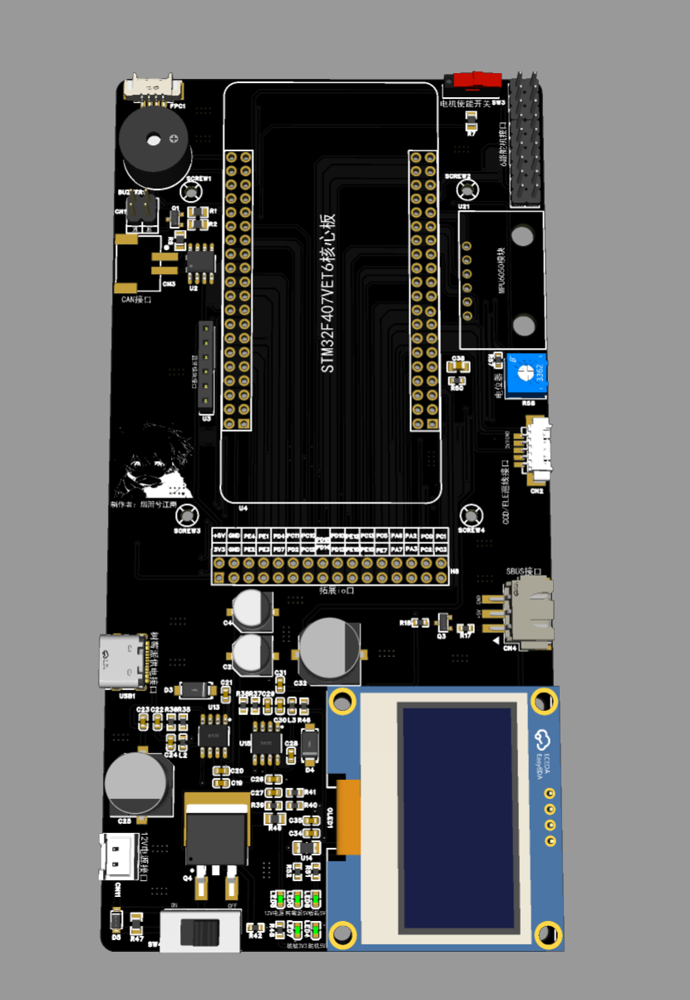
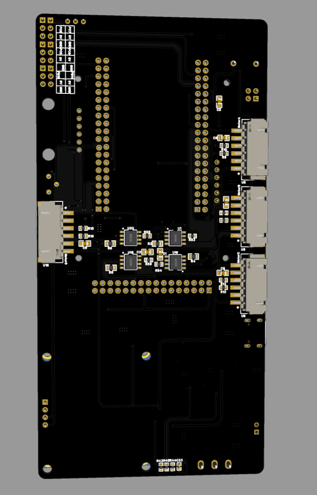
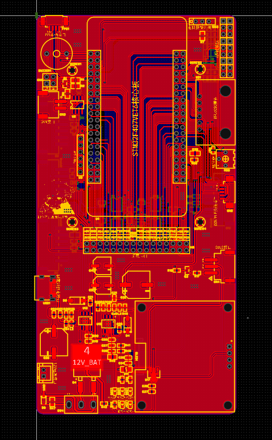
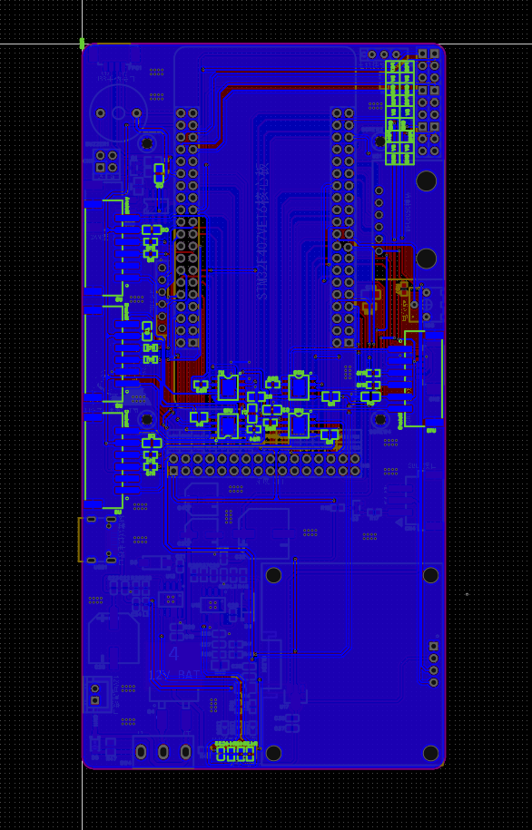
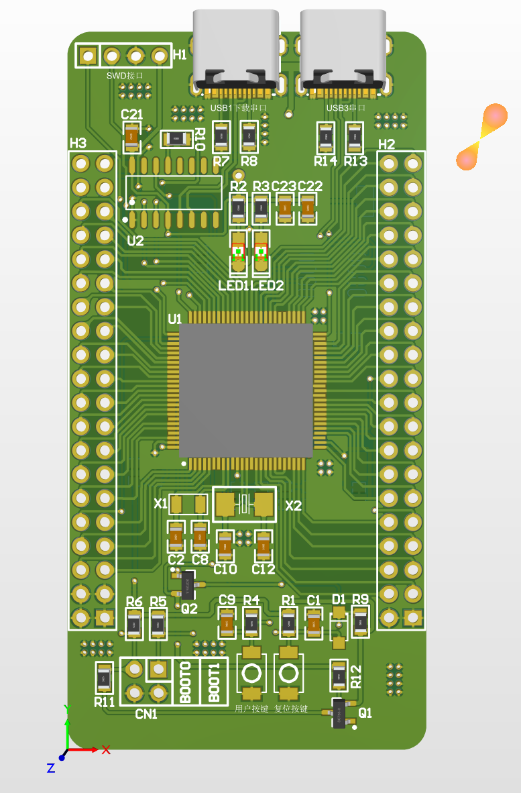
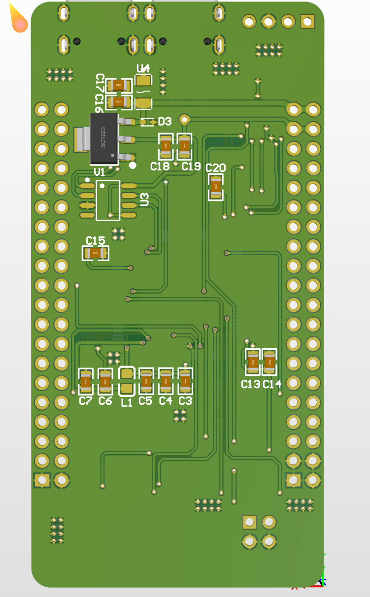
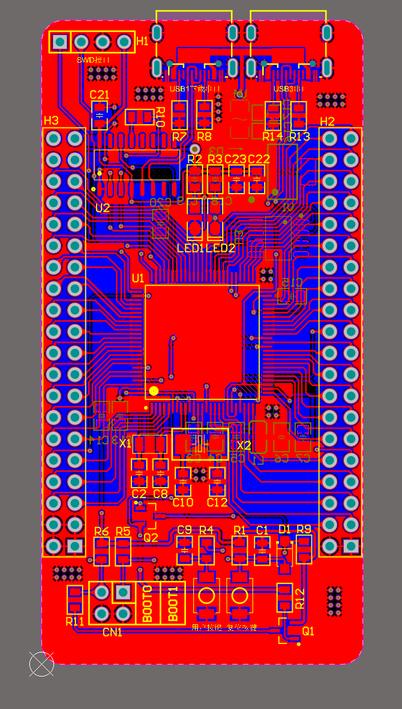
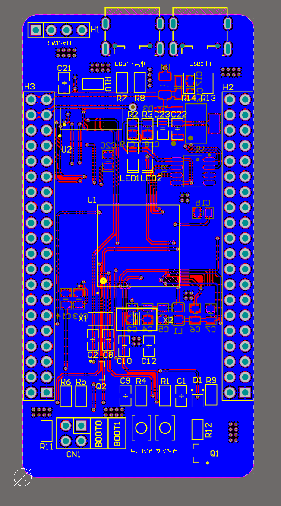

# STM32F407VET6-Based-Intelligent-Vehicle

一个基于 **STM32F407VET6** 主控芯片的 ROS 智能小车硬件开源方案，包含小车底板与核心板的 PCB 设计资料、原理图、Gerber 打板文件、BOM 清单以及 3D 效果图，方便进行硬件复现、学习和二次开发。

> 本仓库当前主要提供硬件设计资料，暂未包含 STM32 固件程序、ROS 节点或上位机软件代码。

## 项目简介

本项目将智能小车的硬件设计拆分为 **底板** 和 **核心板** 两个部分：

- **核心板**：以 STM32F407VET6 为核心，作为小车控制系统的主控硬件平台。
- **底板**：用于承载小车外围电路及接口，便于连接电机、传感器、通信模块和其他扩展设备。
- **ROS 扩展**：项目面向 ROS 智能小车应用场景，可在此硬件基础上继续开发底层控制、传感器采集、串口通信和 ROS 上位机节点。

## 仓库内容

```text
.
├── BOM/
│   ├── 智能小车底板_BOM.xlsx       # 底板物料清单
│   └── 智能小车核心板_BOM.xlsx     # 核心板物料清单
├── Gerber/
│   ├── 智能小车底板打板文件JLC.zip  # 底板 Gerber 打板文件
│   └── 智能小车核心板打板文件.zip   # 核心板 Gerber 打板文件
├── Picture/
│   ├── 底板顶层3D.png
│   ├── 底板底层3D.png
│   ├── 底板顶层PCB.png
│   ├── 底板底层PCB.png
│   ├── 核心板顶层3D.png
│   ├── 核心板底层3D.png
│   ├── 核心板顶层PCB.png
│   └── 核心板底层PCB.png
├── Schematic/
│   ├── 智能小车底板原理图.pdf
│   └── 智能小车核心板原理图.pdf
└── README.md
```

## PCB 设计预览

### 小车底板

| 顶层 3D 效果 | 底层 3D 效果 |
|:---:|:---:|
|  |  |

| 顶层 PCB | 底层 PCB |
|:---:|:---:|
|  |  |

### STM32F407VET6 核心板

| 顶层 3D 效果 | 底层 3D 效果 |
|:---:|:---:|
|  |  |

| 顶层 PCB | 底层 PCB |
|:---:|:---:|
|  |  |

## 硬件资料

### 原理图

- [智能小车底板原理图](./Schematic/智能小车底板原理图.pdf)
- [智能小车核心板原理图](./Schematic/智能小车核心板原理图.pdf)

### BOM 清单

- [智能小车底板 BOM](./BOM/智能小车底板_BOM.xlsx)
- [智能小车核心板 BOM](./BOM/智能小车核心板_BOM.xlsx)

### Gerber 打板文件

- [智能小车底板 Gerber 文件（JLC）](./Gerber/智能小车底板打板文件JLC.zip)
- [智能小车核心板 Gerber 文件](./Gerber/智能小车核心板打板文件.zip)

## 复现流程

1. 下载本仓库中的底板和核心板 **BOM** 文件，确认元器件型号、封装和数量。
2. 阅读对应的 PDF 原理图，了解电路连接关系及接口定义。
3. 下载对应的 Gerber 压缩包，并在下单打板前使用 PCB Gerber 查看器检查板框、层叠、钻孔和阻焊层是否符合预期。
4. 按 BOM 完成 PCB 贴装与焊接，并在上电前检查电源、接口和极性。
5. 完成硬件检查后，再根据实际电路连接开发 STM32 底层控制程序及 ROS 通信功能。

## 开发建议

如果要在本硬件基础上继续完善 ROS 智能小车，可以按以下方向进行开发：

- STM32F407VET6 底层驱动与板级初始化；
- 电机驱动、编码器测速和闭环控制；
- IMU、超声波、红外、激光雷达等传感器接入；
- 通过串口、CAN 或其他通信接口与 ROS 主机通信；
- 编写 ROS 节点，实现速度控制、里程计发布、传感器数据转发和底盘控制；
- 根据使用的 ROS 版本补充启动文件、消息定义和参数配置。

## 注意事项

- Gerber 文件仅适用于本仓库当前版本的 PCB 设计；下单前请结合实际加工厂规则再次检查。
- 装配前请以原理图和 BOM 为准，确认元器件封装、方向及极性。
- 首次上电建议使用限流电源，先检查电源网络和各路输出电压，再连接其他模块。
- 本仓库当前未提供完整的固件和 ROS 软件栈，相关功能需要使用者自行开发或补充。

## 贡献与反馈

欢迎提交 Issue 或 Pull Request，用于补充以下内容：

- STM32 固件源码与编译说明；
- ROS 节点、启动文件和通信协议；
- 更完整的接口定义、装配说明和实物照片；
- 硬件问题修复、设计改进及复现经验。

## License

当前仓库未单独声明开源许可证。如需修改、分发或用于商业项目，请先与项目作者确认授权范围。
